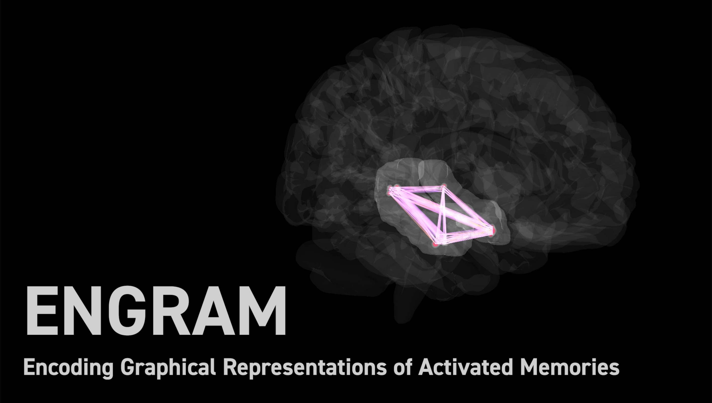

*Click on image to view promo video*

**Encoding Graphical Representations of Activated Memories**
is an open-source Python package for deriving stable. microscale spatiotemporal representations (i.e. binary and continuous sensor readings) for human-scale events (e.g. image labels, movement patterns, etc). As a first use-case, ENGRAM uses depth electrode recordings from human epilepsy patients to derive stable neural representations for specific memory contents (e.g. animals, plants, buildings, etc).

## Installation

Install ENGRAM by running:

    install engram

## Contribute

* Issue Tracker: https://github.com/garrettmflynn/engram/issues
* Source Code: https://github.com/garrettmflynn/engram

## Support

If you are having issues, please email me at garrett@garrettflynn.com