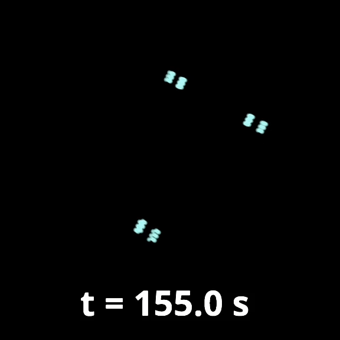

.. _Walkthrough:

================================================
A Gentle Introduction to Neural Prostheses
================================================

:ref:`Intro` 
    This section will acquaint readers with concrete use cases 
    of neural prostheses.

:ref:`ENGRAM` 
    This section will detail the background and features of ENGRAM.

:ref:`HMP` 
    This section is an extensive walkthrough of how to build a memory prosthesis:
    a specific application of cortical prostheses.

:ref:`Conclusion` 
    This section will synthesize what we've learned into projections for the
    future of neural engineering.

:ref:`Resources`
    This section gives additional resources for the curious to explore.

.. _Intro:

Introduction
----------------------------------------

Our minds function best unconsciously. Only when we become conscious,
however, can we take ownership of their processes —-- and control them. 

    "Dementia is troubling because, at the same time as it erodes someone's memory,
    it also eats away at th[e] capacity to create shared meaning. If someone cannot
    remember not just where the milk bottle goes, but what a milk bottle is for,
    then the shared pre-suppositions on which communication, meaning, and identity 
    depend become badly strained :cite:`Leadbeater2015`.

Dr. Pauley is a dementia neurologist treating patients with 
anterograde amnesia (the inability to form new memories) as 
a result of Alzheimer's disease (AD), traumatic brain injury (TBI),
and stroke. 

Entry Vignette 
^^^^^^^^^^^^^^^^^^^^^^^^^^^^^^^^^^^^^^^^^^^
To provide the reader with an inviting Introduction
to the feel of the context in which the case takes place

.. admonition:: Characters
    
    The plan to provide narrative flow from the perspective of the user
    1. **"Dr. Pauley": Dementia neurologist confronting**
    **concrete cases with new tools and unprecedented ethics.**
    2. **Me: Addressed in asides to show my own growth**
    - Impetus: Neuromancer. To walk upon an electronic ground.
    - Ungeneralized Idea: Cognitive states (epi./phen.) are upheld by multiscale neural activity
    - Generalized Idea: Time and space change, but the ground retains memory.
    3. **The CNE: Theodore Berger, Dong Song, Xiwei She**
    4. **The Entrepreneurs:Bryan Johnson, Elon Musk**
    5. **The Visionaries: Ed Boyden, Rajesh Rao**
    6. **The Affected:Those with dementia**
    7. **The Practiced:Epilepsy neurologists who already use RNS devices**
    8. **The Concerned: FDA (regulators) and INS (ethicists)**

An Introduction
^^^^^^^^^^^^^^^^^^^^^^^^^^^^^^^^^^^^^^^^^^^
To familiarize the reader with the central features
including rationale and research procedures

An Extensive Narrative Description
^^^^^^^^^^^^^^^^^^^^^^^^^^^^^^^^^^^^^^^^^^^
To of the case(s) and its context,
which may involve historical or organizational information important for understanding the case

**The Computational Basis of Memory Encoding**
Engrams are memory codes stored *someplace else* than the hippocampus.

Draw from Additional Data Sources
^^^^^^^^^^^^^^^^^^^^^^^^^^^^^^^^^^^^^^^^^^^
Integrate with the researcher's own interpretations
of the issues and both confirming and disproving evidence are presented followed by the
presentation of the overall case assertions

A Closing Vignette
^^^^^^^^^^^^^^^^^^^^^^^^^^^^^^^^^^^^^^^^^^^
As a way of cautoning the reader to the specific case context
saying "I like to close on an experiential note, reminding the reader that this report
is just one person's encounter with a complex case"

.. _ENGRAM:

ENGRAM: The Tool
---------------------------------------------------------

.. _ENGRAM_Definitions:

Definitions
^^^^^^^^^^^^^^^^^^^^^^^^^^^^^^^^^^^^^^^^^^^
**Graphical Representations**

**Activated Memories**

.. _ENGRAM_Origins:

Origins and Early Visions
^^^^^^^^^^^^^^^^^^^^^^^^^^^^^^^^^^^^^^^^^^^^^^^^^^^^^^^^^^^^^^^

Theodore Berger
*********************************************
**CNE**
From rats to primates to humans

**What is a Cortical Prosthesis? The General Architecture**
Replacement parts for the brain must be
(1) truly biomimetic, 
(2) network models, 
(3) bidirectional, and 
(4) adaptive, both to individual patients and their disease progression :cite:`Berger2001`.

**The core concepts & underlying technologies of our lab (ML/NC/CL-DBS)**

Berger had the vision

Song had the math

You must outline the end-user

Ed Boyden
*********************************************
**Neural Coprocessors**

Rajesh Rao
*********************************************
**BTBI**

.. _ENGRAM_Features:

Core Features
^^^^^^^^^^^^^^^^^^^^^^^^^^^^^^^^^^^^^^^^^^^^^^^^^^^^^^^^^^^^^^^

.. _ENGRAM_Containers:

Data Containers
*****************************************************************
    
**ID:** All data from a single individual   
- **Bin:** Binary data
- **Cont:** Continuous data
- **Events:** Event data

Signal Comparison Module
*****************************************************************
    
**For use comparing (1) within individuals (i.e. between channels)** 
**or between multiple individuals**
- Rats vs humans signal quality

.. _ENGRAM_Modeling:

Mathematical Modeling Techniques
*****************************************************************

**Minimal Dependencies**
- Classic Multi-Input Multi-Output (MIMO) Modeling
- Classic Memory Decoding (An L1-regularized logistic regression model)
- Closed Loop Hippocampal Prosthesis

.. _ENGRAM_Integrations:

Integration with Other Software Packages
^^^^^^^^^^^^^^^^^^^^^^^^^^^^^^^^^^^^^^^^^^^^^^
**Tensorflow**
- Deep MIMO and MD Models

**Vispy/Visbrain**
- Novel visualization techniques

**Brainflow**
- Online analysis of OpenBCI streams

**ROOTS**
- Realistic neural growth between functionally connected sources

.. _ENGRAM_Ethics:

Ethical Considerations
^^^^^^^^^^^^^^^^^^^^^^^^^^^^^^^^^^^^^^^^^^^^^^

*Coming soon...*

.. note::

    Ethical concerns with neural prostheses should differ considerably from 
    DBS, aDBS, and clDBS. 
    This paper builds on existing models and literature 
    on implantable neurological devices to distill unique ethical concerns 
    associated with the design, development, and implementation of neural prostheses. 
    In doing so, we hope that the resulting recommendations will be of use 
    to guide this emerging field of neural engineering as it matures.

    For instance, a recent review of the ethical issues related to neuroprosthetics, 
    Walter Glannon questions whether a hippocampal prosthesis could be integrated 
    into the brain’s memory circuits to maintain important aspects of 
    autobiographical memory, such as the interaction between emotional 
    and episodic memory, selective meaning attribution, and place cell function 
    (Glannon, 2016). 
    In reference to case of neurodegenerative diseases such as Alzheimer’s disease, 
    Fabrice Jotterand has also pointed out that restoring psychological continuity 
    (i.e. memory encoding) to patients would not repair the memories lost to 
    neurodegeneration—-and that clinicians have an obligation to help 
    restore the integrity of the patient’s personal identity through a 
    relational narrative with past events where memory had failed (Jotterand, 2019). 
    As more generalizable conclusions are drawn about neural prostheses as a whole, 
    however, a deeper understanding of the core technology behind these devices 
    will be increasingly beneficial. Glannon: “A person with anterograde 
    or retrograde amnesia for many years might have difficulty adjusting 
    cognitively and emotionally to what could be a substantial change 
    in the content of his mental states” (Glannon 2019, 164)].

    In order to effectively design devices that intend to benefit disabled people, 
    researchers must, as a matter of justice, 
    begin to pay close attention to the actual needs and desires of their end-users 
    (Goering & Klein, 2019). 
    And what aspects of neural prostheses can UCD affect? [

    Consider the following: 
    1.	Identification of end users 
    2.	Determination of timing and responsibility for end user engagement 
    3.	Assessment of the significance of personal interactions with end users 
    4.	Comparison of methods for obtaining end user views 
    Principled considerations: 
    1.	Specification of the values underlying BCI research (e.g., sophistication vs. accessibility) 
    2.	Reflection on the ethical reasons to engage end user perspectives
    (Sullivan et al., 2018)]
    In order to be most effective, qualitative instruments 
    should be used to account for potential phenomenological changes 
    resulting from implanted devices,
    as well as patient preference information 
    to inform later risk-benefit assessment 
    (FDA, 2016; Gilbert et al., 2019).

    In such cases, the role of scientists, clinicians, and engineers 
    in risk assessment is to estimate the probability of a beneficial 
    or adverse event based on data provided by sponsors 
    or available in the published literature—-but patient input 
    is what improves our estimates on the weight or importance of an event 
    (Benz and Civillico, 2017).
 

.. _HMP:

How to Build a Memory Prosthesis
----------------------------------------
*Coming soon...*

.. .. jupyter-execute:: 

..     from engram.episodic import shaders
..     shaders.select('engram')

.. _Conclusion:

Conclusion
-----------------------------------------------------------------

A New Era of Open-Source Neuroscience
^^^^^^^^^^^^^^^^^^^^^^^^^^^^^^^^^^^^^^^^^^^^^^^^^^^^^^^^^^^^^^^
*Coming soon...*

Registries + Standardization: The Need for Speed
^^^^^^^^^^^^^^^^^^^^^^^^^^^^^^^^^^^^^^^^^^^^^^^^^^^^^^^^^^^^^^^
*Coming soon...*

.. _Resources:

Additional Resources
---------------------------

* CLARITY_ Technique (Karl Diesseroth)

Elephant_ (Electrophysiology Analysis Toolkit) is an 
emerging open-source, community centered library 
for the analysis of electrophysiological data 
in the Python programming language. 

Neo_ is a Python package for working with electrophysiology data in Python,
together with support for reading a wide range of neurophysiology file formats,
including Spike2, NeuroExplorer, AlphaOmega, Axon, Blackrock, Plexon, Tdt, 
and support for writing to a subset of these formats 
plus non-proprietary formats including HDF5. 
:cite:`Garcia2014`

Neurotic_ is an app for Windows, macOS, and Linux that allows you to 
easily review and annotate your electrophysiology data and simultaneously 
captured video.

Ephyviewer_ is a Python library based on pyqtgraph 
for building custom viewers for electrophysiological signals,
video, events, epochs, spike trains,
data tables, and time-frequency representations of signals.

EEGLearn_ is a set of functions for supervised feature learning/classification 
of mental states from EEG based on "EEG images" idea. 
:cite:`Bashivan2016`

`Wagner Lab`_ is a memory lab at Stanford University that releases all of their 
code with extensive documentation 
and enough functionality to reproduce publication results.
:cite:`Gagnon2018`
:cite:`Waskom2017`

.. _HMP_Glossary:

Glossary
-----------------------------------------------------------------

E
^^^^^^^
*Echphory*

*Engraphy*

R
^^^^^^^^
*Redintegration*

References
-----------

.. bibliography:: references.bib

.. Developer Information

.. _Restoring Active Memory (RAM) program:  https://www.darpa.mil/program/restoring-active-memory

.. Examples of Open Source Tools

.. _Ephyviewer:     https://github.com/NeuralEnsemble/ephyviewer
.. _EEGLearn:       https://github.com/pbashivan
.. _Wagner Lab:     https://github.com/WagnerLabPapers
.. _Neurotic:       https://github.com/jpgill86/neurotic
.. _Elephant:       https://elephant.readthedocs.io/en/latest/
.. _Neo:            https://github.com/NeuralEnsemble/python-neo

.. Visualizations in Neuroscience

.. _CLARITY: https://www.gnu.org/licenses/gpl-3.0https://www.youtube.com/watch?v=c-NMfp13Uug
