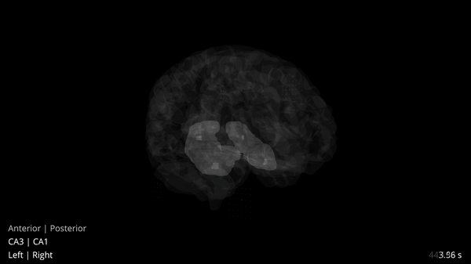

==================
ENGRAM
==================

**Encoding Graphical Representations of Activated Memories (ENGRAM)**
is an open-source Python package for deriving stable, multiscale representations 
of memory contents in the human brain.

|PyPI badge| |GitHub badge| |Docs badge| |Travis badge| |License badge|

    Click image to view promo video

.. toctree::
    :maxdepth: 2
    :hidden:
    
    GettingStarted
    .. Walkthrough
    API
    Contributing
    .. ReleaseNotes
    Acknowledgements

.. |PyPI badge| image:: https://img.shields.io/pypi/v/engram.svg?logo=python&logoColor=white
    :target: PyPI_
    :alt: PyPI project

.. |GitHub badge| image:: https://img.shields.io/badge/github-source_code-blue.svg?logo=github&logoColor=white
    :target: GitHub_
    :alt: GitHub source code

.. |Docs badge| image:: https://img.shields.io/readthedocs/engram/latest.svg?logo=read-the-docs&logoColor=white
    :target: ReadTheDocs_
    :alt: Documentation status

.. |License badge| image:: https://img.shields.io/badge/License-GPLv3-blue.svg
    :target: License_
    :alt: License

.. |Travis badge| image:: https://img.shields.io/travis/com/garrettmflynn/engram/master.svg?logo=travis-ci&logoColor=white
   :target: Travis_
   :alt: Travis build status

.. _GitHub:         https://github.com/garrettmflynn/engram
.. _ReadTheDocs:    https://readthedocs.org/projects/engram
.. _PyPI:           https://pypi.org/project/engram/
.. _License:        https://www.gnu.org/licenses/gpl-3.0
.. _Travis:         https://travis-ci.com/github/GarrettMFlynn/ENGRAM