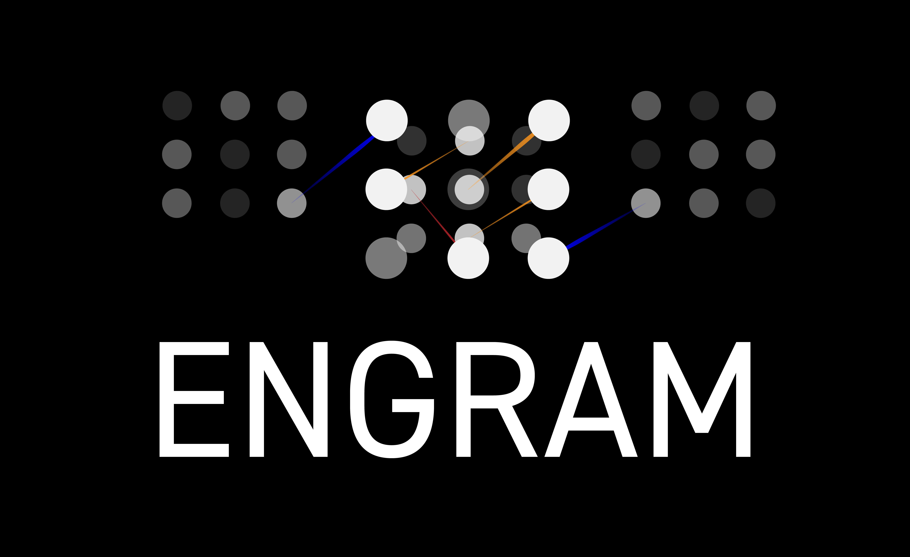

.. module:: engram

================================================
ENGRAM: A User's Guide
================================================

**EN**\coding **G**\raphical **R**\epresentations of **A**\ctivated **M**\emories 
**(ENGRAM)** 
is a Python package for developing cognitive neural prostheses.

.. Note:: 
    - Add motivation section
    - Add build status
    - Add code style (????)
    - Add tech framework used
    - Add stand-out features
    - Add code examples
    - Add installation steps
    - Roughly sketch the API reference
    - Make and show how to run tests
    - Finish the usage guide
    - Let people know how they can contribute into your project. A `contributing guideline <https://github.com/zulip/zulip-electron/blob/master/CONTRIBUTING.md>`_ will be a big plus.
    - Give proper credits. Give proper credits. This could be a link to any repo which inspired you to build this project, any blogposts or links to people who contrbuted in this project.

Documentation
^^^^^^^^^^^^^^^
.. toctree::
    :maxdepth: 1

    GettingStarted
    Process
    Team

License
^^^^^^^^^^^^^^^
ENGRAM is free software, distributed under the 
GNU General Public License (GPLv3).

Project Ideas
^^^^^^^^^^^^^^^

.. Note:: 
    **13 March 2020:** Convert visualizations to Glumpy.

    **1 April 2020:** Release Version 0.1.0 on PyPi. Visualize MIMO algorithm

    **12 April 2020:** Use `ROOTS <https://github.com/bingsome/roots>`_ to grow out artificial connections between functionally connected neurons.

    **1 May 2020:** 
    Model your repository off of these projects

        - `Ephyviewer <https://github.com/NeuralEnsemble/ephyviewer>`_
        - `EEGLearn <https://github.com/pbashivan>`_
        - `Wagner Lab <https://github.com/WagnerLabPapers>`_
        - `Neurotic <https://github.com/jpgill86/neurotic>`_
        - `Elephant <https://elephant.readthedocs.io/en/latest/>`_

    **30 June 2020:** Open-source the code and DARPA data.

